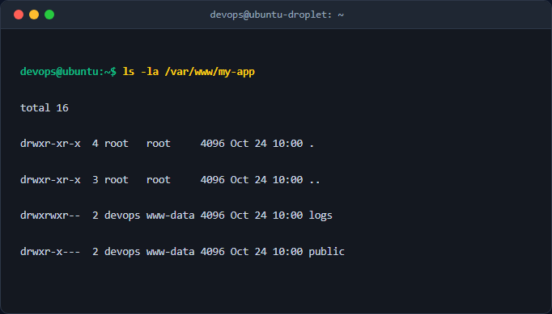

# Báo cáo kỹ thuật: Khảo sát FHS và Phân quyền File/Folder nâng cao

## 1. Mục tiêu & Bối cảnh kỹ thuật
Báo cáo này ghi nhận quá trình thiết lập cấu trúc thư mục chuẩn theo phân cấp FHS (Filesystem Hierarchy Standard) cho một ứng dụng web tại đường dẫn `/var/www/my-app`. Yêu cầu đặt ra là thiết lập phân quyền chính xác cho thư mục công khai (`public`) và thư mục nhật ký hệ thống (`logs`), đảm bảo tính bảo mật và tuân thủ nguyên tắc quyền tối thiểu (Principle of Least Privilege) trên hệ điều hành Linux.

## 2. Các bước thực hiện chi tiết

### Bước 1: Khởi tạo cấu trúc thư mục
Sử dụng lệnh `mkdir` với cờ `-p` để tạo đồng thời thư mục gốc và các thư mục con một cách an toàn.
```bash
sudo mkdir -p /var/www/my-app/public
sudo mkdir -p /var/www/my-app/logs
```
- `sudo`: Thực thi lệnh với quyền quản trị viên cao nhất.
- `mkdir -p`: Tạo thư mục cha nếu chưa tồn tại, không báo lỗi nếu thư mục đã tồn tại.

### Bước 2: Thiết lập phân quyền truy cập (Permissions)
Áp dụng mã phân quyền bát phân (octal) cho từng thư mục theo yêu cầu bảo mật:
```bash
sudo chmod 750 /var/www/my-app/public
sudo chmod 770 /var/www/my-app/logs
```
- `chmod 750 /var/www/my-app/public`: Chủ sở hữu (Owner) có quyền đọc, ghi, thực thi (rwx = 7); Nhóm sở hữu (Group) có quyền đọc và thực thi (r-x = 5); Người dùng khác (Others) không có quyền nào (--- = 0).
- `chmod 770 /var/www/my-app/logs`: Chủ sở hữu và Nhóm sở hữu đều có toàn quyền đọc, ghi, thực thi (rwx = 7); Người dùng khác không có quyền truy cập.

### Bước 3: Cấu hình quyền sở hữu (Ownership)
Phân định rõ ràng chủ sở hữu cá nhân và nhóm vận hành hệ thống web server (`www-data`):
```bash
sudo chown -R $USER:www-data /var/www/my-app
```
- `chown -R`: Thay đổi chủ sở hữu và nhóm sở hữu đệ quy cho toàn bộ thư mục bên trong.
- `$USER:www-data`: Gán tài khoản hiện tại làm chủ sở hữu và nhóm `www-data` làm nhóm sở hữu.

## 3. Kiểm tra & Xác thực kết quả
Thực thi câu lệnh liệt kê chi tiết để kiểm tra kết quả phân quyền:
```bash
ls -la /var/www/my-app
```


## 4. Kết luận & Best Practices bảo mật vận hành
- Tuân thủ nghiêm ngặt mô hình phân quyền POSIX trên Linux.
- Hạn chế tối đa quyền truy cập của nhóm `others` (`---`) nhằm ngăn chặn rò rỉ dữ liệu nhạy cảm từ thư mục `logs`.
- Sử dụng nhóm `www-data` giúp web server đọc được tài nguyên tĩnh tại `public` một cách an toàn.